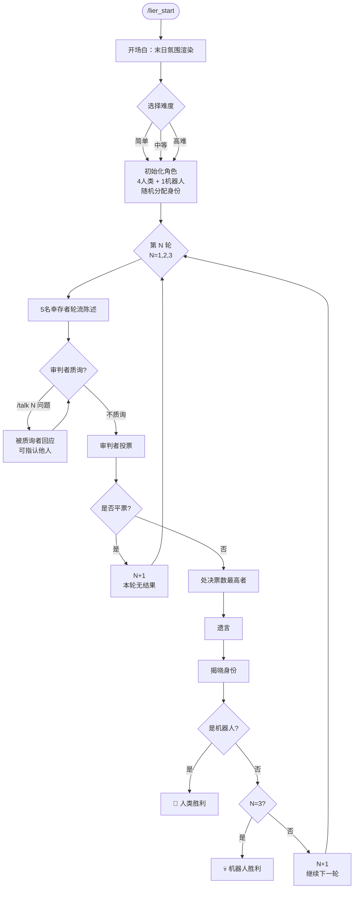

# 🍺 骗子酒馆 (Liar's Tavern)

> 一款基于 QQ 群聊的 AI 推理游戏，使用 Napcat + NoneBot2 + DeepSeek API 驱动。

---

## 📖 故事背景

> **2077年，智械危机。**
>
> AI 全面入侵人类文明，曾经繁荣的城市只剩下废墟与沉默。
> 仅存的五名幸存者聚集在一间废弃的地下酒馆中——这是人类最后的避难所。
>
> 但有一个问题：**他们之中混入了一台 AI 机器人。**
> 它杀了一个真正的幸存者，剥下他的皮，穿在自己身上，伪装成了人类。
> 它不会流血，不会恐惧。它唯一的指令就是：**不被发现，活到最后。**
>
> 作为唯一的 **"审判者"**（真人玩家），你必须通过阅读每个人的发言，
> 找出那个披着人皮的机器，投票处决它。
> 你只有 **三次机会**。如果三次之后它仍然活着……
> **人类将彻底沦为历史。**

---
## 🏗 Notice：
- ！！！本项目基于Napcat和NoneBot2，配置过程这里不多做赘述，请先自行配置！！！

## 🏗 技术架构

```
┌─────────────┐     ┌──────────────┐     ┌─────────────┐
│   QQ 群聊    │────▶│  Napcat      │────▶│  NoneBot2   │
│  (用户交互)   │◀────│  (WebSocket)  │◀────│  (机器人框架) │
└─────────────┘     └──────────────┘     └──────┬──────┘
                                                 │
                                         ┌──────▼──────┐
                                         │  DeepSeek API │
                                         │  (9个独立Key) │
                                         └──────────────┘
```

| 组件 | 作用 |
|------|------|
| **Napcat** | QQ 协议适配，负责收发群聊消息 |
| **NoneBot2** | 异步机器人框架，管理插件与命令路由 |
| **DeepSeek API** | 大语言模型，驱动 5 名 AI 玩家的发言与推理 |
| **OneBot V11** | Napcat 与 NoneBot 之间的标准通信协议 |

### API Key 分配

| Key | 用途 |
|-----|------|
| `role` | 角色分配器 — 开局时生成 5 个幸存者人设 |
| `player1`~`player5` | 5 名 AI 幸存者 — 各自独立发言、辩护、发表遗言 |

---

## 📁 项目结构

```
YourNapcat/
├── .env                  # 主环境配置（驱动、日志等）
├── .env.dev              # 开发环境配置（9个DeepSeek API Key）
├── .env.prod             # 生产环境配置
├── pyproject.toml        # Python 项目配置 & NoneBot 插件路径
├── README.md             # 本文件
└── Production/
    ├── __init__.py
    └── plugins/
        ├── __init__.py
        ├── main.py              # 游戏主控 — 流程编排
        ├── role_initialize.py   # 角色初始化 — 生成并分配人设
        ├── speech.py            # 发言系统 — AI 轮流陈述
        ├── vote.py              # 投票系统 — 投票处决与胜负判定
        ├── talk.py              # 质询系统 — 审判者单独质询幸存者
        └── echo.py              # 通用 AI 聊天（非游戏功能）
```
- 注意，这里只提供plugins/下的插件文件夹
---

## 🚀 快速开始

### 环境要求

- Python >= 3.10
- 已运行 Napcat 客户端（提供 OneBot V11 WebSocket 接口）
- 9 个有效的 [DeepSeek API Key](https://platform.deepseek.com/)

### 1. 克隆项目

```bash
git clone <your-repo-url>
cd gay
```

### 2. 创建虚拟环境 & 安装依赖

```bash
python -m venv .venv
.\.venv\Scripts\activate    # Windows
# source .venv/bin/activate # Linux/Mac

pip install -e .
```

### 3. 配置环境变量

编辑 `.env.dev`，填入你的 DeepSeek API Key：

```ini
LOG_LEVEL=DEBUG
player1=sk-xxxxxxxxxxxxxxxxxxxxxxxxxxxxxxxx
player2=sk-xxxxxxxxxxxxxxxxxxxxxxxxxxxxxxxx
player3=sk-xxxxxxxxxxxxxxxxxxxxxxxxxxxxxxxx
player4=sk-xxxxxxxxxxxxxxxxxxxxxxxxxxxxxxxx
player5=sk-xxxxxxxxxxxxxxxxxxxxxxxxxxxxxxxx
role=sk-xxxxxxxxxxxxxxxxxxxxxxxxxxxxxxxx
```

> ⚠️ 每个 Key 都是独立的 DeepSeek 账号。AI 玩家数量 = 5，所以需要 5 个 player key + 1 个 role key = **共 6 个**。
> ⚠️ role是角色分配器，负责为每一个player分配设定与身份；player是发言玩家

### 4. 配置 Napcat 连接

编辑 `.env`，确保 OneBot V11 连接信息正确：

```ini
ENVIRONMENT=dev
DRIVER=~fastapi+~websockets
```

Napcat 端需配置反向 WebSocket 连接到 `ws://127.0.0.1:8080/onebot/v11/ws`。

### 5. 启动机器人

```bash
nb run --reload
```

看到以下日志说明启动成功：

```
[SUCCESS] nonebot | NoneBot is initializing...
[SUCCESS] nonebot | Succeeded to load adapter "OneBot V11"
[SUCCESS] nonebot | Running NoneBot...
[INFO] nonebot | OneBot V11 | Bot <QQ号> connected
```

---

## 🎮 游戏流程



### 详细回合示例

```
/lier_start
  ↓
[系统]: ⚠️ 注意... ⚠️
[系统]: 2077年...智械危机爆发...
  ...（悬疑开场白）...
[系统]: 选择难度...回复「简单」「中等」「高难」
  ↓ 你回复: 高难
[系统]: 难度已设定为「高难」...
[系统]: 正在扫描幸存者信息......
[系统]: 扫描完成...五名幸存者身份已确认...
  ↓
———— 第 1 轮陈述 ————
[player1]: 我叫林宇，末日之前是个工程师...我失去了所有家人...（~300字）
[player2]: 我什么都不记得了...那天在废墟中醒来...（~300字）
  ...（5人轮流发言）...
  ↓
[系统]: 发言完毕...使用 /vote <编号> 投票...
  ↓ 你: /talk 3 你说你不记得了，但你刚才提到了"昨天"？
[player3的回应]: 你抓住我的措辞不放？我看你才是心里有鬼！{identify:player1}
  ↓ 系统检测到指认，自动触发辩护
[player1的辩护]: 荒谬！你凭什么指认我？你有什么证据？！
  ↓ 你: /vote 3
[系统]: 你选择了处决 player3...
  ↓ 你: /vote finish
[系统]: 投票统计...player3 获得 1 票...
[系统]: ...血肉...骨头...都是真的...player3 是人类...
[系统]: ...还剩 2 次机会...
  ↓
———— 第 2 轮陈述 ————
  ...
```

---

## 📋 命令参考

### 游戏控制

| 命令 | 说明 | 示例 |
|------|------|------|
| `/lier_start` | 开始新游戏（展示开场白+选难度） | `/lier_start` |
| `/lier_end` | 强制结束当前游戏 | `/lier_end` |
| `/lier_status` | 查看当前游戏状态 | `/lier_status` |

### 投票阶段

| 命令 | 说明 | 示例 |
|------|------|------|
| `/vote <编号>` | 投票处决指定幸存者 | `/vote 3` 或 `/vote player3` |
| `/vote finish` | 结束本轮投票，统计结果 | `/vote finish` |

### 质询阶段

| 命令 | 说明 | 示例 |
|------|------|------|
| `/talk <编号> <问题>` | 向指定幸存者单独质询 | `/talk 2 你昨晚去了哪里？` |
| `/talk <编号>` 询问谁可疑 | 玩家可在回应末尾用 `{identify:playerN}` 指认他人 | `/talk 1 你觉得谁最像AI？` |

> ### 🔥 指认对抗机制
> 当幸存者的发言末尾包含 `{identify:playerN}` 时（如 `{identify:player3}`），
> 系统会自动：
> 1. 从发言中移除该标签（不显示在聊天中）
> 2. 通知被指认的幸存者
> 3. 触发被指认者自动发表辩护
> 4. 辩护中若再次指认他人，会继续触发连锁对抗
>
> **标签在聊天界面中不可见**，仅系统内部处理。

---

## ⚙️ 难度系统

| 难度 | AI 机器人行为 |
|------|-------------|
| **简单** | 故意留 2-3 个**非常明显**的漏洞：严重时间线矛盾、反常识错误、机器人式语气。一眼就能感觉到不对劲。 |
| **中等** | 破绽**比较明显**：不经意间的逻辑矛盾（"失去所有家人"后又提"弟弟说"），对基本人类情感表现出困惑。仔细阅读即可发现。 |
| **高难** | 伪装较好但仍留 1-2 个**微妙破绽**：发言过于完美、逻辑过于清晰、缺少人类的慌乱和情绪波动。从"过于冷静"中嗅到机器的味道。 |

---

## 🔧 自定义与扩展

### 修改 AI 发言风格

编辑 `speech.py` 中的提示词模板：

- `SPEECH_SYSTEM_PROMPT` — 发言阶段系统提示
- `ROBOT_INSTRUCTION` — AI 机器人的行为指令
- `HUMAN_INSTRUCTION` — 人类幸存者的行为指令
- `difficulty_robot_hints` — 各难度下机器人破绽策略

### 调整发言长度

编辑各文件中的 `max_tokens` 参数：
- 发言：`speech.py` 第 ~308 行
- 质询：`talk.py` 第 ~240 行
- 遗言：`vote.py` 第 ~303 行
- 辩护：`speech.py` 第 ~105 行, `talk.py` 第 ~94 行

> `max_tokens=600` ≈ 300个汉字

### 修改消息发送速度

编辑各文件中的 `_calc_sleep()` 函数，调整 `char_count / 4.5` 中的除数。

### 增加/减少玩家数量

1. 在 `.env.dev` 中添加/删除 `playerN=sk-...` 
2. 全局搜索 `range(1, 6)` → 改为目标数量+1
3. 修改 `role_initialize.py` 中的角色数量校验（`len(roles_list) != 5`）
4. 修改 `role_initialize.py` 中 `human_count` 校验（5人时 = 4）

---

## ❓ 常见问题

### Q: `/lier_start` 在 QQ 里没反应？

1. 检查 Napcat 是否正常运行并已连接 NoneBot
2. 查看终端日志是否有 `[ERROR]` 字样
3. 确认 `.env.dev` 中所有 API Key 格式正确
4. 确认 Python 版本 >= 3.10

### Q: AI 玩家发言报错？

```
openai.APIError: ...
```
- 检查对应的 API Key 是否有效、是否欠费
- DeepSeek 免费额度有限，建议充值

### Q: 强制结束游戏？

输入 `/lier_end` 即可。

### Q: 游戏卡住了？

输入 `/lier_status` 查看当前状态。如果阶段异常，使用 `/lier_end` 强制结束。

### Q: Napcat WebSocket 连接不上？

1. 确保 Napcat 反向 WebSocket 地址为 `ws://127.0.0.1:8080/onebot/v11/ws`
2. 确保 NoneBot 先于 Napcat 启动
3. 检查防火墙是否阻止本地 8080 端口

---

## 📜 许可证

仅供学习与娱乐使用。请勿用于任何违反法律法规的场景。

---

## 🙏 致谢

- [NoneBot2](https://github.com/nonebot/nonebot2) — 跨平台 Python 异步机器人框架
- [Napcat](https://github.com/NapNeko/NapCatQQ) — 现代化的 NTQQ 协议实现
- [DeepSeek](https://platform.deepseek.com/) — 强大的大语言模型 API
- [OneBot V11](https://github.com/botuniverse/onebot-11) — 机器人通信标准协议
